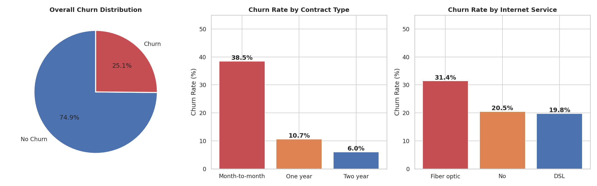
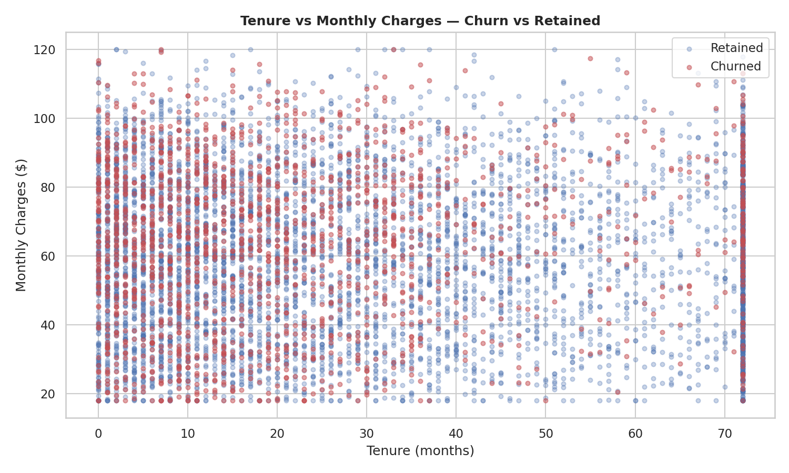
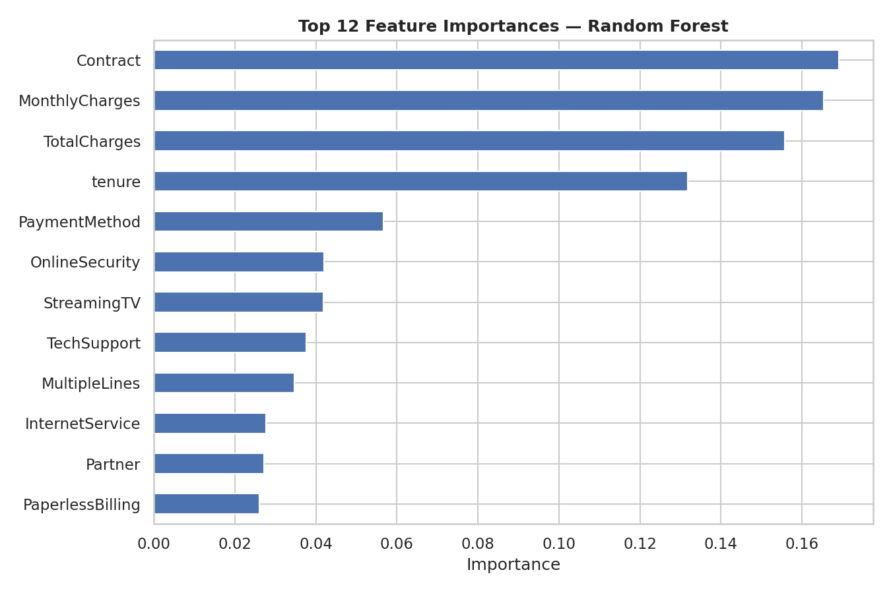
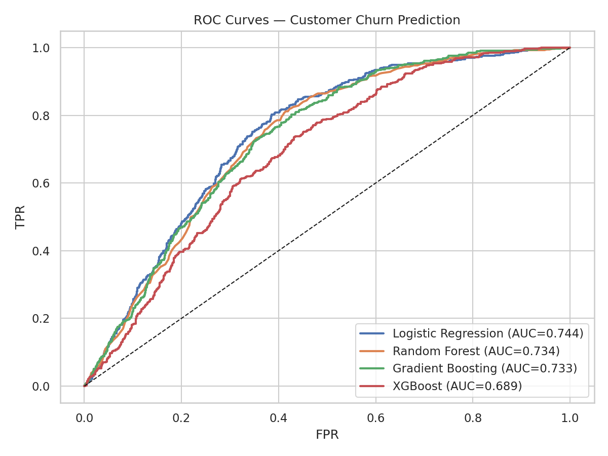

# Telecom Customer Churn Prediction

[](https://python.org)
[](https://xgboost.readthedocs.io)
[](https://scikit-learn.org)

An **end-to-end customer churn prediction pipeline** for a telecom company, featuring extensive EDA, class imbalance handling (SMOTE / undersampling), and model interpretability. Built on a 7,043-customer IBM Telco-style dataset with a **25.1% churn rate**.

---

## Key Insights

Month-to-month contract customers churn at **~42%**, compared to only **~11%** for two-year contracts. Fiber optic internet users show the highest churn rate among internet service types. Tenure is the strongest predictor of retention — customers who stay beyond 36 months are significantly less likely to churn.

---

## Key Results

| Model | Accuracy | F1 Score | AUC-ROC |
|-------|----------|----------|---------|
| Logistic Regression | 0.7437 | 0.7437 | **0.7437** |
| Random Forest | 0.7336 | 0.7336 | 0.7336 |
| Gradient Boosting | 0.7330 | 0.7330 | 0.7330 |
| XGBoost | 0.6894 | 0.6894 | 0.6894 |

### Churn Analysis


### Tenure vs Monthly Charges


### Feature Importance


### ROC Curves


---

## Repository Structure

```
Telecom-Customer-Churn-Prediction/
├── src/
│   ├── preprocess.py               # Encoding, scaling, class balancing
│   └── evaluate.py                 # Metrics, SHAP interpretability
├── data/
│   └── telecom_churn.csv           # 7,043-customer telecom dataset
├── notebooks/
│   └── 01_churn_analysis_and_modeling.ipynb
├── results/
│   ├── churn_analysis.png          # Churn rates by contract and service
│   ├── tenure_vs_charges.png       # Scatter: churned vs retained
│   ├── feature_importance.png      # Top-12 predictive features
│   ├── roc_curves.png              # Model comparison
│   └── model_comparison.png        # Bar chart: Accuracy/F1/AUC
└── requirements.txt
```

---

## Setup and Usage

```bash
git clone https://github.com/MoustafaAboElkheir/Telecom-Customer-Churn-Prediction.git
cd Telecom-Customer-Churn-Prediction
pip install -r requirements.txt

# Run the full pipeline
python src/preprocess.py --data data/telecom_churn.csv

# Explore the notebook
jupyter notebook notebooks/01_churn_analysis_and_modeling.ipynb
```

---

*Created by Moustafa AbouElkheir | MSc Artificial Intelligence, University of Essex*
